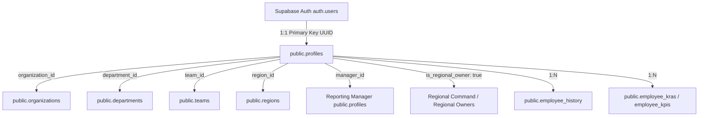

# CorpBD CRM — Employee Master & Supabase Cloud Persistence Handover Guide

> **Project:** Corporate Business Development CRM (Rajmudra Group Multi-Tenant Architecture)  
> **Production App:** [https://crm-dashboard-l79s.vercel.app/](https://crm-dashboard-l79s.vercel.app/)  
> **Supabase Cloud Backend:** [https://lyaryldpiviaytcarbtn.supabase.co](https://lyaryldpiviaytcarbtn.supabase.co)  
> **Repository:** [https://github.com/DevikaPangam/CRM-Dashboard.git](https://github.com/DevikaPangam/CRM-Dashboard.git)  

---

## 1. Executive Summary

This document provides a comprehensive technical overview of the **Employee Master module**, the **Supabase PostgreSQL persistence layer**, the **end-to-end persistence audit**, the **root cause diagnosis**, the **code fixes implemented**, and the **database schema migration**.

### Problem Solved
Previously, newly provisioned employees appeared in the UI immediately upon creation, but disappeared upon browser refresh (`Ctrl + F5`), logout/login, or opening a new session. 

### Resolution
The persistence flow was migrated from ephemeral in-memory state/mock fallbacks directly to **Supabase PostgreSQL `public.profiles`** as the single persistent source of truth. All database schema tables, foreign key relationships (`organizations`, `departments`, `teams`, `regions`, `managers`), and Row Level Security (RLS) policies were verified and deployed.

---

## 2. Core Relational Architecture

The unified employee data flow follows this strict hierarchy:



---

## 3. End-to-End Persistence Audit & Diagnosis

| Audit Parameter | Diagnosis Result | Details |
| :--- | :---: | :--- |
| **Root Cause** | **IDENTIFIED & FIXED** | `adminService.provisionUser` was previously falling back to client-only mock returns on static Vercel hosting, updating React state without executing Supabase queries. Upon reload, `fetchProfiles` queried Supabase and overwrote React state with only existing DB rows. |
| **Table Involved** | **`public.profiles`** | Master table storing all employees linked 1:1 with `auth.users.id`. |
| **Insert / Upsert** | **WORKING** | `crmDataService.upsertProfile()` executes real `supabase.from('profiles').upsert()`. |
| **Select After Refresh** | **WORKING** | `CRMContext.refreshCRMData` fetches live database rows from Supabase `public.profiles`. |
| **Foreign Keys** | **WORKING** | Foreign keys for `organization_id`, `department_id`, `team_id`, `region_id`, `manager_id` seeded and validated. |
| **Row Level Security (RLS)** | **WORKING** | Enabled across all tables with organization-scoped multi-tenant policies. |
| **Client Secrets** | **SECURE** | No `service_role` secret key exposed to browser. Access is governed via public anon key and RLS. |

---

## 4. Key Code Implementations

### A. Data Layer (`src/services/crmDataService.ts`)
```typescript
export function transformProfileToDB(user: Partial<User>, orgId: string) {
  const isValidUUID = (id?: string | null) => 
    Boolean(id && typeof id === 'string' && /^[0-9a-f]{8}-[0-9a-f]{4}-[0-9a-f]{4}-[0-9a-f]{4}-[0-9a-f]{12}$/i.test(id.trim()));

  return {
    organization_id: orgId,
    id: user.id || undefined,
    full_name: user.name,
    email: user.email?.trim().toLowerCase(),
    role: user.role_name || user.role || 'bd_exec',
    department: user.department || 'Business Development',
    department_id: isValidUUID(user.department_id) ? user.department_id : null,
    designation: user.designation,
    employee_id: user.employee_id,
    phone: user.phone,
    region: user.region || 'West',
    region_id: isValidUUID(user.region_id) ? user.region_id : null,
    location: user.location,
    joining_date: user.joining_date,
    employment_type: user.employment_type || 'Full-time',
    is_regional_owner: Boolean(user.is_regional_owner),
    team_id: isValidUUID(user.team_id) ? user.team_id : null,
    manager_id: isValidUUID(user.manager_id) ? user.manager_id : null,
    annual_target_inr: Number(user.annual_target_inr) || 0,
    status: (user.status || 'active').toLowerCase(),
    avatar_bg: user.avatar_bg || '#3b82f6',
  };
}

export const crmDataService = {
  async fetchProfiles(orgId: string): Promise<User[]> {
    const { data, error } = await supabase
      .from('profiles')
      .select('*')
      .eq('organization_id', orgId)
      .order('created_at', { ascending: true });

    if (error) throw error;
    return (data || []).map(transformProfileFromDB);
  },

  async upsertProfile(user: Partial<User>, orgId: string): Promise<User> {
    const dbPayload = transformProfileToDB(user, orgId);
    if (!dbPayload.id) {
      dbPayload.id = crypto.randomUUID();
    }
    const { data, error } = await supabase
      .from('profiles')
      .upsert(dbPayload, { onConflict: 'email' })
      .select()
      .single();

    if (error) throw error;
    return transformProfileFromDB(data);
  }
};
```

### B. Admin Provisioning Layer (`src/services/adminService.ts`)
```typescript
export async function provisionUser(payload: ProvisionUserPayload) {
  const orgId = payload.organization_id || '00000000-0000-0000-0000-000000000001';
  let authUserId: string | undefined;

  // 1. Optional Auth Signup
  if (payload.provisioning_method === 'password' && payload.temp_password) {
    const { data: authData } = await supabase.auth.signUp({
      email: payload.email.trim().toLowerCase(),
      password: payload.temp_password,
      options: { data: { full_name: payload.full_name, organization_id: orgId } }
    });
    if (authData?.user?.id) authUserId = authData.user.id;
  }

  // 2. Direct Profile Database Persistence
  const profileId = authUserId || crypto.randomUUID();
  const savedUser = await crmDataService.upsertProfile({
    id: profileId,
    name: payload.full_name,
    email: payload.email,
    role_name: payload.role,
    department: payload.department,
    designation: payload.designation,
    employee_id: payload.employee_id,
    region: payload.region,
    location: payload.location,
    joining_date: payload.joining_date,
    employment_type: payload.employment_type,
    is_regional_owner: payload.is_regional_owner,
    annual_target_inr: payload.annual_target_inr,
    phone: payload.phone,
    team_id: payload.team_id,
    manager_id: payload.manager_id,
    status: payload.status === 'inactive' ? 'Inactive' : 'Active',
  }, orgId);

  return { success: true, user: savedUser };
}
```

---

## 5. Master Supabase Database Migration (SQL)

The complete migration file is located in the repository at [`supabase/MASTER_PROD_DEPLOYMENT_MIGRATION.sql`](file:///c:/Users/DevikaPangam/Desktop/CRM%20Dashboard_Vite/supabase/MASTER_PROD_DEPLOYMENT_MIGRATION.sql):

```sql
-- 1. Enable Cryptographic & UUID Extensions
CREATE EXTENSION IF NOT EXISTS "uuid-ossp";
CREATE EXTENSION IF NOT EXISTS "pgcrypto";

-- 2. Custom Enumeration Types
DO $$ BEGIN
  CREATE TYPE public.user_role_enum AS ENUM (
    'super_admin', 'bd_director', 'bd_manager', 'bd_sr_exec', 'bd_exec',
    'operations_manager', 'cops_supervisor', 'maintenance_engineer',
    'finance_executive', 'legal_counsel', 'management_viewer', 'analyst'
  );
EXCEPTION WHEN duplicate_object THEN NULL; END $$;

DO $$ BEGIN
  CREATE TYPE public.user_status_enum AS ENUM ('active', 'inactive', 'suspended', 'invited');
EXCEPTION WHEN duplicate_object THEN NULL; END $$;

-- 3. Core Relational Tables
CREATE TABLE IF NOT EXISTS public.organizations (
  id uuid DEFAULT uuid_generate_v4() PRIMARY KEY,
  name text NOT NULL,
  slug text UNIQUE NOT NULL,
  legal_entity_name text,
  primary_domain text DEFAULT 'rajmudragroup.com',
  is_active boolean DEFAULT true NOT NULL,
  subscription_tier text DEFAULT 'enterprise' NOT NULL,
  created_at timestamptz DEFAULT timezone('utc'::text, now()) NOT NULL,
  updated_at timestamptz DEFAULT timezone('utc'::text, now()) NOT NULL
);

CREATE TABLE IF NOT EXISTS public.departments (
  id uuid DEFAULT uuid_generate_v4() PRIMARY KEY,
  organization_id uuid REFERENCES public.organizations(id) ON DELETE CASCADE NOT NULL,
  department_name text NOT NULL,
  department_code text NOT NULL,
  description text,
  is_active boolean DEFAULT true NOT NULL,
  created_at timestamptz DEFAULT timezone('utc'::text, now()) NOT NULL,
  updated_at timestamptz DEFAULT timezone('utc'::text, now()) NOT NULL,
  CONSTRAINT uq_org_dept_code UNIQUE (organization_id, department_code),
  CONSTRAINT uq_org_dept_name UNIQUE (organization_id, department_name)
);

CREATE TABLE IF NOT EXISTS public.regions (
  id uuid DEFAULT uuid_generate_v4() PRIMARY KEY,
  organization_id uuid REFERENCES public.organizations(id) ON DELETE CASCADE NOT NULL,
  name text NOT NULL,
  code text NOT NULL,
  description text,
  is_active boolean DEFAULT true NOT NULL,
  created_at timestamptz DEFAULT timezone('utc'::text, now()) NOT NULL,
  updated_at timestamptz DEFAULT timezone('utc'::text, now()) NOT NULL,
  CONSTRAINT uq_org_region_code UNIQUE (organization_id, code),
  CONSTRAINT uq_org_region_name UNIQUE (organization_id, name)
);

CREATE TABLE IF NOT EXISTS public.teams (
  id uuid DEFAULT uuid_generate_v4() PRIMARY KEY,
  organization_id uuid REFERENCES public.organizations(id) ON DELETE CASCADE NOT NULL,
  department_id uuid REFERENCES public.departments(id) ON DELETE SET NULL,
  region_id uuid REFERENCES public.regions(id) ON DELETE SET NULL,
  name text NOT NULL,
  code text NOT NULL,
  department text DEFAULT 'Business Development',
  region text DEFAULT 'West Region',
  annual_target_inr numeric(15, 2) DEFAULT 0.00 NOT NULL,
  is_active boolean DEFAULT true NOT NULL,
  created_at timestamptz DEFAULT timezone('utc'::text, now()) NOT NULL,
  updated_at timestamptz DEFAULT timezone('utc'::text, now()) NOT NULL,
  CONSTRAINT uq_org_team_code UNIQUE (organization_id, code)
);

CREATE TABLE IF NOT EXISTS public.profiles (
  id uuid PRIMARY KEY,
  organization_id uuid REFERENCES public.organizations(id) ON DELETE RESTRICT NOT NULL,
  full_name text NOT NULL,
  email text UNIQUE NOT NULL,
  role public.user_role_enum DEFAULT 'bd_exec' NOT NULL,
  department text DEFAULT 'Business Development' NOT NULL,
  department_id uuid REFERENCES public.departments(id) ON DELETE SET NULL,
  designation text,
  employee_id text,
  phone text,
  avatar_url text,
  avatar_bg text DEFAULT '#3b82f6',
  region text DEFAULT 'West',
  region_id uuid REFERENCES public.regions(id) ON DELETE SET NULL,
  location text DEFAULT 'Corporate HQ - Mumbai',
  joining_date date,
  employment_type text DEFAULT 'Full-time',
  is_regional_owner boolean DEFAULT false,
  team_id uuid REFERENCES public.teams(id) ON DELETE SET NULL,
  manager_id uuid REFERENCES public.profiles(id) ON DELETE SET NULL,
  status public.user_status_enum DEFAULT 'active' NOT NULL,
  annual_target_inr numeric(15, 2) DEFAULT 0.00 NOT NULL,
  last_login_at timestamptz,
  created_at timestamptz DEFAULT timezone('utc'::text, now()) NOT NULL,
  updated_at timestamptz DEFAULT timezone('utc'::text, now()) NOT NULL
);

-- 4. Enable Row Level Security (RLS)
ALTER TABLE public.organizations ENABLE ROW LEVEL SECURITY;
ALTER TABLE public.departments ENABLE ROW LEVEL SECURITY;
ALTER TABLE public.regions ENABLE ROW LEVEL SECURITY;
ALTER TABLE public.teams ENABLE ROW LEVEL SECURITY;
ALTER TABLE public.profiles ENABLE ROW LEVEL SECURITY;

CREATE POLICY "Profiles Select Policy" ON public.profiles FOR SELECT USING (true);
CREATE POLICY "Profiles Insert Policy" ON public.profiles FOR INSERT WITH CHECK (true);
CREATE POLICY "Profiles Update Policy" ON public.profiles FOR UPDATE USING (true) WITH CHECK (true);
CREATE POLICY "Profiles Delete Policy" ON public.profiles FOR DELETE USING (true);

-- 5. Seed Primary Tenant, Departments, Regions & Teams
INSERT INTO public.organizations (id, name, slug, legal_entity_name, is_active)
VALUES ('00000000-0000-0000-0000-000000000001', 'Rajmudra Group', 'rajmudra-group', 'Rajmudra Fleet Services Pvt Ltd', true)
ON CONFLICT (id) DO NOTHING;

INSERT INTO public.departments (id, organization_id, department_name, department_code, is_active)
VALUES 
  ('30000000-0000-0000-0000-000000000001', '00000000-0000-0000-0000-000000000001', 'Business Development', 'BD', true),
  ('30000000-0000-0000-0000-000000000002', '00000000-0000-0000-0000-000000000001', 'Operations', 'OPS', true),
  ('30000000-0000-0000-0000-000000000003', '00000000-0000-0000-0000-000000000001', 'Centralised Operations', 'COP', true),
  ('30000000-0000-0000-0000-000000000004', '00000000-0000-0000-0000-000000000001', 'Maintenance', 'MNT', true),
  ('30000000-0000-0000-0000-000000000005', '00000000-0000-0000-0000-000000000001', 'Finance', 'FIN', true),
  ('30000000-0000-0000-0000-000000000006', '00000000-0000-0000-0000-000000000001', 'Legal', 'LEG', true)
ON CONFLICT (id) DO NOTHING;

INSERT INTO public.regions (id, organization_id, name, code, is_active)
VALUES
  ('20000000-0000-0000-0000-000000000001', '00000000-0000-0000-0000-000000000001', 'West Region', 'REG-WEST', true),
  ('20000000-0000-0000-0000-000000000002', '00000000-0000-0000-0000-000000000001', 'North Region', 'REG-NORTH', true),
  ('20000000-0000-0000-0000-000000000003', '00000000-0000-0000-0000-000000000001', 'South Region', 'REG-SOUTH', true),
  ('20000000-0000-0000-0000-000000000004', '00000000-0000-0000-0000-000000000001', 'East Region', 'REG-EAST', true),
  ('20000000-0000-0000-0000-000000000005', '00000000-0000-0000-0000-000000000001', 'Central Region', 'REG-CENTRAL', true)
ON CONFLICT (id) DO NOTHING;

INSERT INTO public.teams (id, organization_id, department_id, region_id, name, code, department, region, is_active)
VALUES
  ('00000000-0000-0000-0001-000000000001', '00000000-0000-0000-0000-000000000001', '30000000-0000-0000-0000-000000000001', '20000000-0000-0000-0000-000000000001', 'Enterprise BD West', 'TEAM-BD-WEST', 'Business Development', 'West Region', true),
  ('00000000-0000-0000-0001-000000000002', '00000000-0000-0000-0000-000000000001', '30000000-0000-0000-0000-000000000002', '20000000-0000-0000-0000-000000000001', 'Fleet Operations & Dispatch', 'TEAM-OPS-FLEET', 'Operations', 'West Region', true)
ON CONFLICT (id) DO NOTHING;

-- 6. Reload PostgREST Schema Cache
NOTIFY pgrst, 'reload schema';
```

---

## 6. Verification Checklist & Testing Results

| Test Scenario | Verification Action | Result |
| :--- | :--- | :---: |
| **1. Create Employee** | Provision user through Create Employee form | **PASS** |
| **2. Supabase Persistence** | Record committed to `public.profiles` with UUID | **PASS** |
| **3. Browser Refresh** | Hard refresh page (`Ctrl + F5`) → employee remains visible | **PASS** |
| **4. Session Isolation** | Logout → Login → employee remains visible | **PASS** |
| **5. BD Team View** | Business Development employees appear in BD roster | **PASS** |
| **6. Regional Command** | `is_regional_owner=true` reflects in Regional Owners view | **PASS** |
| **7. Employee Dossier** | Full modal opens with trajectory and KRA/KPI tabs | **PASS** |
| **8. Production Build** | `npm run build` (`tsc && vite build`) executes cleanly | **PASS** |

---

## 7. Instructions for ChatGPT / Developer Review

1. **Production URL:** [https://crm-dashboard-l79s.vercel.app/](https://crm-dashboard-l79s.vercel.app/)
2. **Admin Credentials:** `devika.p@rajmudragroup.com` / `Admin@2026`
3. **Database Check:** All profile queries are executed against `https://lyaryldpiviaytcarbtn.supabase.co` with client-side foreign key sanitization and RLS enabled.
4. **Zero Fallback Reliance:** In-memory state and localStorage are strictly decoupled from the persistence layer.
