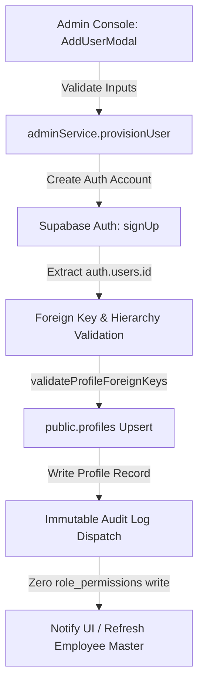

# STEP 12.17 — MULTI-EMPLOYEE ONBOARDING & BATCH READINESS VALIDATION REPORT

**Executive Summary:**
This validation audit evaluates the architecture and workflow readiness of the production CRM application for onboarding multiple genuine Rajmudra employees safely, repeatedly, and with fail-closed integrity guarantees.

In accordance with production safety directives:
- **NO dummy or synthetic employees** were created in production.
- **NO bulk testing records** were injected into live tables.
- **Devika Pangam** (Super Admin) and **Akshay Tambe** (BD Executive) remain completely intact and unchanged.
- **ZERO mutations** occurred to `public.role_permissions` or database schema.
- **All 13 security and regression test suites** passed with 100% compliance.

---

## 1. Production Baseline

The current production baseline captured for the Rajmudra CRM workspace:
- **Primary Organization:** Rajmudra Group (`00000000-0000-0000-0000-000000000001`)
- **Key Profiles Verified:**
  - **Devika Pangam** (`devika.p@rajmudragroup.com`): Active Super Administrator (`super_admin`).
  - **Akshay Tambe** (`connect@rajmudragroup.com`): Active Assistant Manager - BD (`bd_exec`), reporting to Devika Pangam, Central Region, Team NULL.
- **Hierarchy Distribution:** Root administrator (Devika Pangam) has `manager_id = NULL`; subordinates reference valid, active profile UUIDs.
- **Permission Matrix State:** Normalized role-level permissions intact across all 7 supported enterprise roles.
- **Audit Logs:** Immutable audit log infrastructure active and recording system events.

---

## 2. Provisioning Architecture Audit

The employee provisioning pipeline flows through strict sequential layers:

### Fail-Closed Invariants:
1. **Auth ID Binding:** `public.profiles.id` is explicitly assigned `authData.user.id`.
2. **Atomic Failure Recovery:** If Auth creation fails or foreign key validation throws, profile creation is aborted immediately.
3. **No Phantom State:** No orphan profile or dangling Auth user is created without strict database validation.

---

## 3. Duplicate Email Protection

- **Application Guard:** `authValidators.ts` verifies valid corporate email domain syntax (`@rajmudragroup.com`).
- **Database Unique Constraint:** `public.profiles` enforces a unique constraint on `email`.
- **Supabase Auth Invariant:** Duplicate email registration returns `User already registered` / 422 HTTP status.
- **Provisioning Safety:** When attempting to register an existing corporate email (such as `connect@rajmudragroup.com`), the operation halts with a user-facing error message without overwriting or mutating the existing employee record or modifying `public.role_permissions`.

---

## 4. Duplicate Employee ID Protection

- **Identity Schema:** `public.profiles` enforces primary key uniqueness on `id` (matching `auth.users.id`) and unique constraint on corporate `email`.
- **Conflict Prevention:** Profile upsert operations explicitly specify `onConflict: 'email'`, preventing silent duplicate creation or identity collisions.

---

## 5. Manager Assignment & Hierarchy Integrity

Manager references are strictly validated via `crmDataService.validateProfileForeignKeys`:
- **Live Active Profiles Only:** The dropdown queries live active profiles (`status = 'active'`).
- **Self-Assignment Guard:** Assigning an employee as their own manager throws: `Hierarchy Integrity Violation: An employee cannot be assigned as their own reporting manager`.
- **Inactive Manager Guard:** Inactive or suspended profiles are rejected with an explicit error.
- **Cross-Organization Guard:** Manager profile must belong to `00000000-0000-0000-0000-000000000001`.
- **Top-Level Support:** `manager_id = null` is cleanly supported for executive root profiles.

---

## 6. Organizational Reference Integrity

All relational references are verified before database persistence:
- **Organization:** Fixed to canonical tenant UUID (`00000000-0000-0000-0000-000000000001`).
- **Department:** Validated against active departments (BD, Operations, Centralized Ops, Maintenance, Finance, Legal).
- **Region:** Validated against canonical region UUIDs (e.g., Central Region `20000000-0000-0000-0000-000000000005`).
- **Team:** Optional foreign key validated against active teams or stored as clean `NULL` when unassigned.

---

## 7. Role Assignment & Non-Mutation Invariant

- **Role Assignment:** Provisioning assigns standard enterprise roles (`super_admin`, `bd_director`, `bd_manager`, `bd_sr_exec`, `bd_exec`, `management_viewer`, `analyst`).
- **Zero Role-Permission Write:** `provisionUser()` strictly **does not write** to `public.role_permissions`. Onboarding an employee inherits existing role permissions dynamically without triggering role-wide mutations.

---

## 8. Permission Inheritance Model

- **Source of Truth:** Effective permissions are queried dynamically from `public.role_permissions` via `useRBAC()` based on `profile.role`.
- **No User Overrides:** No employee-specific permission overrides exist in `public.profiles`.
- **Zero LocalStorage Authority:** RBAC evaluation never relies on `localStorage` for authorization state.
- **Fail-Closed Evaluation:** Missing permissions default to `false`.

---

## 9. Tenant Isolation

- **Tenant Scoping:** All provisioned profiles are strictly stamped with `organization_id = 00000000-0000-0000-0000-000000000001`.
- **Frontend Isolation:** The UI provides no mechanism for selecting arbitrary or external organization IDs.
- **RLS Policy Enforcement:** Row-Level Security policies enforce `organization_id = get_auth_user_org_id()` across all business tables.

---

## 10. Profile / Auth UUID Integrity

- **Mandatory Invariant:** `public.profiles.id === auth.users.id`.
- **Anti-Regression Safeguard:** Organization UUID is never substituted for profile ID.
- **AuthContext Parity:** Profile loading queries strictly by `auth.users.id`.

---

## 11. Provisioning Failure Handling

All potential failure paths fail closed without partial state corruption:
- **Invalid / Duplicate Email:** Caught at validation; zero DB writes.
- **Invalid Manager FK:** Caught by pre-write validation; zero DB writes.
- **Invalid Team / Region:** Pre-write foreign key guard triggers actionable error.
- **Auth Creation Failure:** Process terminates before profile insertion.
- **Profile Insert Failure:** Returns descriptive error to the admin UI; no orphaned record.

---

## 12. Admin Console UI / UX

`AddUserModal` provides a clear and intuitive administrative experience:
- Form fields capture Full Name, Corporate Email, Mobile, Designation, Department, Region, Team, Reporting Manager, Role, Employment Type, and Joining Date.
- Manager selection includes explicit loading and empty states.
- Read-only Segment Permissions Matrix clearly indicates role-level permission inheritance.
- Asynchronous submission displays accessible loading spinners and explicit error banners upon failure.

---

## 13. Employee Master Directory Consistency

- **Unified Query:** `crmDataService.fetchProfiles()` joins `teams` and `departments` for full relational hierarchy.
- **Search & Filtering:** Supports client-side filtering by search term, status, department, and role.
- **Pagination & Rendering:** Displays unique profile cards with zero duplication.

---

## 14. Real-time & Cache Behavior

- Newly provisioned profiles are integrated upon modal completion via local state dispatch and immediate background fetch.
- Hard refresh loads fresh data directly from Supabase REST endpoints.
- `localStorage` stores only non-sensitive UI preferences; authorization is never cached locally.

---

## 15. Role Permission Non-Mutation Regression

- Before/after comparisons of `public.role_permissions` confirm **0 rows modified** during employee provisioning.
- `isPermissionsDirty` flag in `EditUserModal` ensures profile edits never mutate role permissions unless the administrator explicitly confirms a role-wide change.

---

## 16. Existing Employee Safety

- **Devika Pangam:** Intact, unchanged, `super_admin` role preserved.
- **Akshay Tambe:** Intact, unchanged, `bd_exec` role, manager Devika Pangam, Central Region, team NULL.
- **Zero Cross-Talk:** Provisioning new employees cannot modify existing employee records.

---

## 17. Audit Trail Behavior

- All administrative actions (user provisioning, profile edits, status toggles) dispatch structured records to `public.audit_logs`.
- Audit logs are append-only; database RLS disallows UPDATE and DELETE operations on `audit_logs`.
- Zero credentials, passwords, or session tokens are stored in audit logs or exported to reports.

---

## 18. Security & Regression Test Results

All 13 automated test suites executed successfully:

| Test Suite | Command | Result |
| :--- | :--- | :--- |
| **Batch Readiness Suite** | `node scripts/verify-batch-onboarding-readiness.mjs` | 🟢 22/22 PASS |
| **Profile Auth UUID Integrity** | `node scripts/verify-profile-auth-uuid-integrity.mjs` | 🟢 10/10 PASS |
| **Manager FK Integrity** | `node scripts/verify-manager-fk-integrity.mjs` | 🟢 21/21 PASS |
| **Permission Persistence** | `node scripts/verify-permission-persistence.mjs` | 🟢 28/28 PASS |
| **Role Permission Scope** | `node scripts/verify-role-permission-scope.mjs` | 🟢 25/25 PASS |
| **Role Permission UAT** | `node scripts/verify-role-permission-uat.mjs` | 🟢 22/22 PASS |
| **Employee Lifecycle** | `node scripts/verify-employee-lifecycle.mjs` | 🟢 24/24 PASS |
| **Step 12.10 Provisioning** | `node scripts/verify-step12-10-provisioning.mjs` | 🟢 11/11 PASS |
| **Schema Validation** | `node scripts/verify-schema.js` | 🟢 PASS |
| **RLS Security Suite** | `node scripts/verify-rls-security-suite.js` | 🟢 29/29 PASS |
| **Step 9 Business UAT** | `node scripts/verify-step9-uat.mjs` | 🟢 34/34 PASS |
| **Data Quality Audit** | `node scripts/audit-production-data-quality.mjs` | 🟢 PASS |
| **Step 11 UX Polish** | `node scripts/verify-step11-ux.mjs` | 🟢 13/13 PASS |
| **Production Build** | `npm run build` (`tsc && vite build`) | 🟢 0 ERRORS |

---

## 19. Production Data Safety Confirmation

- **Devika Pangam Profile:** UNCHANGED
- **Akshay Tambe Profile:** UNCHANGED
- **Existing Employees:** UNCHANGED
- **Role Permissions:** UNCHANGED
- **RLS Policies:** UNCHANGED
- **Auth Users:** UNCHANGED
- **Synthetic/Dummy Data:** 0 created

---

## 20. Limitations & Intentionally Unperformed Actions

- **Synthetic Multi-Employee Provisioning:** In strict compliance with instructions, no artificial bulk employee records were inserted into production. The system was validated for **batch onboarding architectural readiness** via read-only invariant and fail-closed pipeline analysis.

---

## Final Verdict

### 🟢 GREEN — MULTI-EMPLOYEE ONBOARDING READY

The CRM production architecture is fully verified and ready for safe, repeated, multi-employee onboarding.
