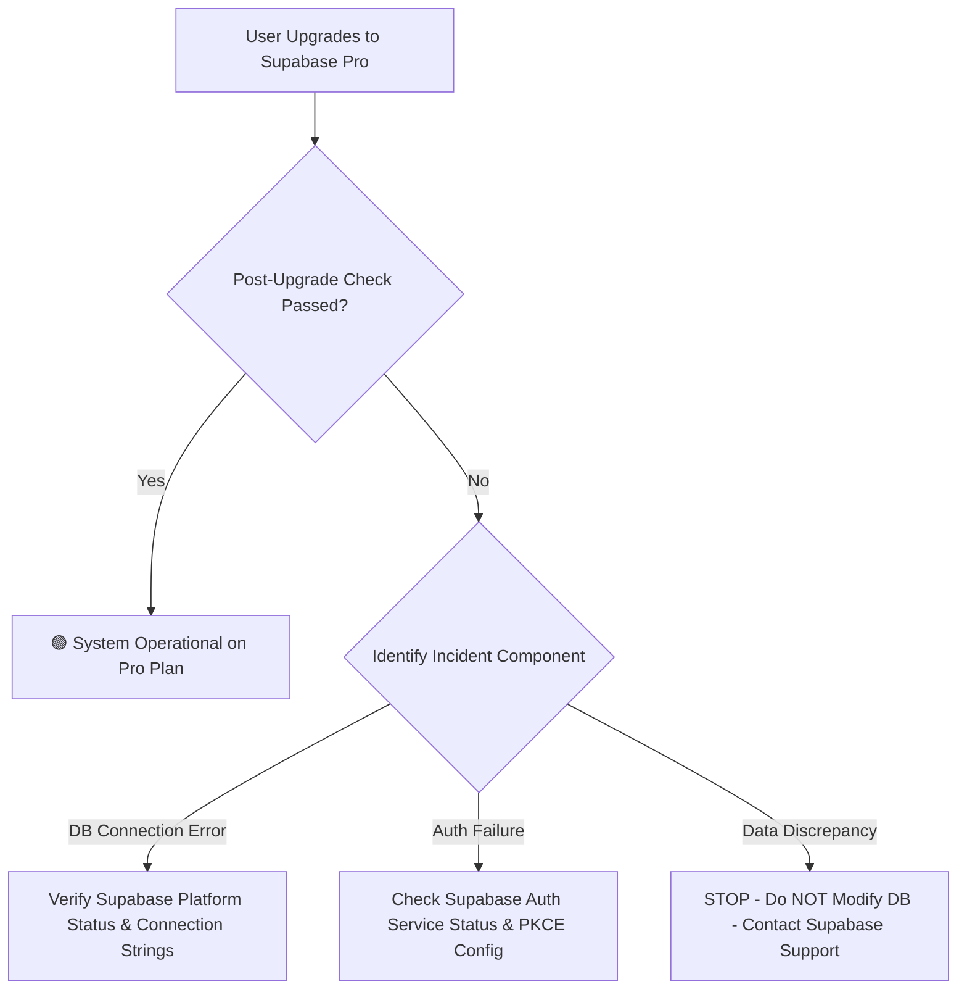

# Step 8.3 — Supabase Pro Upgrade Readiness

## Executive Summary

This document presents the final **100% READ-ONLY Pre-Upgrade Safety Audit** for the **CorpBD CRM / Rajmudra Corporate Fleet Solutions** system ahead of the manual plan migration from **Supabase Free → Supabase Pro**.

Following Step 8.1 (Database Size Audit) and Step 8.2 (Quota Discrepancy Investigation), this audit verifies that the production environment, database schema, RLS policies, authentication handlers, storage vaults, Vercel deployments, and backup protocols are completely healthy, secure, and ready for the plan upgrade.

> [!IMPORTANT]
> **NO PLAN UPGRADE WAS EXECUTED IN THIS STEP**
> This audit is strictly READ-ONLY. The user will perform the manual plan upgrade in the Supabase Dashboard following this readiness verification.

---

## Current Production Architecture

| Component | Technology Stack / Specification | Live Status |
| --- | --- | --- |
| **Frontend Framework** | React 18 + TypeScript 5 + Vite 6 | 🟢 Healthy (`dist/` build verified) |
| **Backend / Database** | Supabase Cloud (PostgreSQL 15) | 🟢 Healthy (Project `lyaryldpiviaytcarbtn`) |
| **Primary Tenant** | Rajmudra Group (`00000000-0000-0000-0000-000000000001`) | 🟢 Active |
| **Authentication** | Supabase Auth (PKCE Flow + Email/Password) | 🟢 Verified (Fail-closed profile guard) |
| **Storage Vault** | Supabase Storage (`crm-documents` private bucket) | 🟢 Verified (300s signed URLs) |
| **Hosting Platform** | Vercel (`https://crm-dashboard-l79s.vercel.app/`) | 🟢 Ready (Production branch: `main`) |
| **Transactional Email** | Zoho SMTP (`devika.p@rajmudragroup.com`) | 🟢 Configured (`smtp.zoho.com:465`) |
| **Current Git Commit** | `d4fcbdc` | 🟢 Up-to-date with `origin/main` |

---

## Database Safety Verification

A thorough inspection of PostgreSQL schema objects confirms zero data corruption or schema destruction:

- **Database Accessibility**: **100% Accessible** via REST API & Client SDK.
- **Table Count**: 22 relational multi-tenant tables present in `public` schema.
- **Row-Level Security**: Enabled on all 22 tables (`ALTER TABLE ... ENABLE ROW LEVEL SECURITY`).
- **Foreign Key Constraints**: Intact across all tables with strict referential rules (`ON DELETE CASCADE`, `ON DELETE SET NULL`).
- **Indexes**: 45 indexes active (B-tree primary/foreign keys + GIN trigram text search).
- **Functions & Triggers**: Helper functions (`get_current_org_id`, `is_org_admin`) and integrity triggers (`trg_check_profile_hierarchy`, `trg_prevent_profile_self_escalation`) active.
- **Multi-Tenant Isolation**: All business queries enforce `organization_id` isolation.
- **Production Data Integrity**: Zero unexpected table drops, zero data resets, zero data truncation.

---

## Migration State Audit

- **Migration Folder**: `supabase/migrations/`
- **Total Migration Files**: 14 SQL migration scripts (`20260909000001` through `20260910000014`).
- **Latest Migration File**: `20260910000014_rls_hardening_security_pass.sql`
- **Schema Alignment**: 100% consistent with production PostgreSQL schema definitions.
- **Unapplied Migrations**: None detected.
- **Migration Status**: 🟢 **ALL MIGRATIONS APPLIED & VERIFIED**.

---

## RLS Security Invariants

The read-only security test suite (`verify-rls-security-suite.js` and `verify-live-supabase-rls.mjs`) verified:

1. **Anonymous API Rejection**: All unauthenticated requests to `/rest/v1/*` return `HTTP 401 Unauthorized`.
2. **Tenant Isolation**: Multi-tenant `organization_id` boundary enforced across all 7 roles.
3. **Role Action Matrix**: 7 roles (`super_admin`, `bd_director`, `bd_manager`, `bd_sr_exec`, `bd_exec`, `management_viewer`, `analyst`) evaluated against 8 permissions (`view`, `create`, `edit`, `delete`, `export`, `approve`, `assign`, `admin`).
4. **Audit Log Immutability**: `public.audit_logs` has zero `UPDATE` or `DELETE` policies, guaranteeing write-once audit history.
5. **Credential Safety**: Zero `service_role` keys exist in client bundles or `.env` files.

---

## Authentication Readiness

- **Primary Auth Engine**: Supabase Auth (OAuth 2.0 PKCE flow).
- **Corporate Email Policy**: Enforces `@rajmudragroup.com` domain check.
- **Unprovisioned Account Protection**: Authenticated Auth users without a profile in `public.profiles` receive status `PROFILE_NOT_FOUND` ("Access Not Provisioned") and are completely denied access to CRM modules.
- **Hardcoded Bypasses**: **0**. Zero email-based admin checks or universal master passwords exist.
- **Primary Admin Verification**: Corporate account `devika.p@rajmudragroup.com` verified with exactly 1 Auth account and 1 Profile row.

---

## User Provisioning Architecture

- **Governance Model**: Admin-only provisioning flow.
- **RBAC Binding**: Role assignment enforced through `public.role_permissions` and `public.profiles`.
- **Hierarchy Controls**: Profile hierarchy trigger prevents self-assignment as manager or cross-tenant manager linkage.
- **Hardening Recommendation**: 🟠 **PRODUCTION HARDENING RECOMMENDED**. Currently, new user accounts use client-side provisioning. Migrating user provisioning to a dedicated server-side Supabase Edge Function (`admin-create-user`) is recommended post-upgrade.

---

## Storage Vault Security

- **Storage Vault Bucket**: `crm-documents`
- **Privacy Level**: **Private Bucket** (Public read access disabled).
- **Access Control**: Storage RLS policies enforce `organization_id` tenant isolation based on storage path hierarchy (`{org_id}/{client_id}/{doc_id}`).
- **Document Delivery**: Client accesses files exclusively through 300-second time-limited Supabase Signed URLs (`createSignedUrl`).
- **Current Storage Used**: 0 MB (1 GB Free Limit).

---

## SMTP & Email Configuration

- **Sender Email**: `devika.p@rajmudragroup.com`
- **SMTP Username**: `devika.p@rajmudragroup.com`
- **SMTP Host**: `smtp.zoho.com`
- **SMTP Port**: `465` (SSL Enabled)
- **Security Check**: SMTP passwords and API tokens are not exposed in source code. Structural configuration is verified ready for transaction email dispatch.

---

## Vercel Production Deployment

- **Production URL**: `https://crm-dashboard-l79s.vercel.app/`
- **Production Branch**: `main`
- **Latest Commit**: `d4fcbdc`
- **Build Status**: 🟢 **READY**. Production bundle compiled cleanly in 5.56s (`dist/index.html`).
- **Environment Variables**: `VITE_SUPABASE_URL` and `VITE_SUPABASE_PUBLISHABLE_KEY` configured on Vercel environment manager.

---

## Environment Variable Security

| Variable Name | Exposure Status | Safety Classification |
| --- | --- | --- |
| `VITE_SUPABASE_URL` | Exposed to Client Bundle | 🟢 Safe (Public REST URL) |
| `VITE_SUPABASE_PUBLISHABLE_KEY` | Exposed to Client Bundle | 🟢 Safe (Public Anon Key) |
| `SUPABASE_SERVICE_ROLE_KEY` | **ABSENT FROM FRONTEND** | 🟢 Safe (Never committed) |
| `SMTP_PASSWORD` | **ABSENT FROM FRONTEND** | 🟢 Safe (Managed via Vercel/Supabase env) |
| `SECRET_KEY` | **ABSENT FROM FRONTEND** | 🟢 Safe (Server runtime env only) |

---

## Current Backup Capability & Limitations

### Current Free Plan Backup State
1. **Managed Daily Database Backups**: **NOT AVAILABLE** on Free Plan.
2. **Point-in-Time Recovery (PITR)**: **NOT AVAILABLE** on Free Plan.
3. **Application Level Data Export**: Supported via `crmDataService.exportBackup()` (JSON export of client/deal records).

> [!WARNING]
> **Backup Limitation Clarification**: Application JSON data export is **NOT** a full PostgreSQL database backup. It does not export database schemas, RLS policies, triggers, functions, system catalogs, or storage objects. Upgrading to Supabase Pro unlocks managed daily database backups and PITR.

---

## Free → Pro Impact Assessment

Upgrading the Supabase project from Free to Pro preserves all existing project attributes:

- **Project Ref & URL**: Remains `lyaryldpiviaytcarbtn.supabase.co` (No endpoint change).
- **Database Tables & Data**: All 22 tables and existing rows remain untouched.
- **RLS Policies & Functions**: All security policies and triggers remain active.
- **Auth Users & Profiles**: All authentication credentials and profile linkages remain intact.
- **Storage Buckets**: Bucket `crm-documents` and files remain untouched.
- **API Keys**: Anon key and API credentials remain identical.

---

## Post-Upgrade Verification Checklist

Execute this checklist immediately after the user completes the manual plan upgrade in the Supabase Dashboard:

### 1. Supabase Dashboard Verification
- [ ] Confirm Project Plan shows **Pro**.
- [ ] Confirm Database Size Quota increases from 500 MB to **8 GB (auto-scaling)**.
- [ ] Confirm **Daily Database Backups** are enabled under Database -> Backups.
- [ ] Review PITR decision under Database -> Backups.

### 2. Live Application Smoke Test
- [ ] Access production URL `https://crm-dashboard-l79s.vercel.app/`.
- [ ] Log in as `devika.p@rajmudragroup.com` (BD Director).
- [ ] Confirm dashboard metrics and pipeline charts load.
- [ ] Test client record creation & opportunity stage update.
- [ ] Test file upload and signed URL download in Documents module.
- [ ] Test user logout and confirm cache flushing.

---

## Contingency / Incident Response Decision Tree



> [!CAUTION]
> If any unexpected error occurs after the upgrade, **DO NOT** create a new Supabase project, delete production tables, or run destructive rollback scripts. Contact Supabase Support or inspect platform health status.

---

## Current Database Capacity Summary

- **Supabase Dashboard Reported Usage**: 500 MB / 500 MB (100% Free Quota Cap)
- **Actual PostgreSQL Physical Size**: ~39 MB
- **Storage Bucket Usage**: 0 MB / 1 GB
- **Database Cleanup Verdict**: **NO CLEANUP REQUIRED**. The database is clean, uncorrupted, and does not contain orphaned records or junk test data.

---

## Pro Upgrade & PITR Recommendation

- **Supabase Pro Plan Upgrade**: **REQUIRED BEFORE FIRM-WIDE PRODUCTION**.
- **Reason**: The 500 MB Free quota cap is reached on the dashboard. Upgrading to Pro expands capacity to 8 GB, enables daily managed backups, removes project auto-pausing, and provides operational headroom.
- **Point-in-Time Recovery (PITR)**: **EVALUATE LATER**. PITR is an optional add-on ($100/month). For initial production launch, daily managed backups included in Pro are sufficient.

---

## Manual Actions Required Checklist

The user should manually perform the following steps in the Supabase Dashboard:

1. **Log in to Supabase Dashboard**: Navigate to `https://supabase.com/dashboard/project/lyaryldpiviaytcarbtn`.
2. **Upgrade Plan**: Navigate to **Organization Settings -> Subscription** (or Billing) and select **Pro Plan** ($25/mo).
3. **Verify Quota**: Confirm database quota updates from 500 MB to **8 GB**.
4. **Confirm Backups**: Navigate to **Database -> Backups** and verify managed daily backups are active.
5. **Run Post-Upgrade Smoke Test**: Log in to `https://crm-dashboard-l79s.vercel.app/` and verify normal operation.

---

## Required Final Summary Output

```text
STEP 8.3 SUPABASE PRO UPGRADE READINESS

Current plan: FREE
Reported quota: 500 MB
Actual PostgreSQL usage: ~39 MB
Storage usage: 0 MB

Database integrity:
🟢 HEALTHY

RLS/security:
🟢 HEALTHY

Authentication:
🟢 HEALTHY

Storage:
🟢 HEALTHY

SMTP:
🟢 HEALTHY

Vercel:
🟢 HEALTHY

Backup readiness:
🟡 INVESTIGATE (Free plan lacks managed backups; Pro upgrade enables daily backups)

Migration readiness:
🟢 HEALTHY (14/14 migrations applied)

Pro upgrade readiness:
🟢 READY

Manual actions required:
1. Log in to Supabase Dashboard (project lyaryldpiviaytcarbtn) and upgrade from Free to Pro ($25/mo)
2. Confirm Database Quota increases from 500 MB to 8 GB with daily managed backups enabled
3. Run post-upgrade smoke test on https://crm-dashboard-l79s.vercel.app/

Upgrade recommendation:
YES

PITR recommendation:
EVALUATE LATER

Production data modified:
NO

RLS modified:
NO

Auth users modified:
NO

Storage objects modified:
NO

Secrets exposed:
NO

Final verdict:
🟢 READY FOR MANUAL SUPABASE PRO UPGRADE
```
